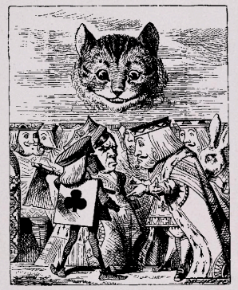

Review: Alice's Adventures in Wonderland

Rating: ★★★★☆ (4/5)

Review Date: July 10, 2023

Alice's Adventures in Wonderland (AAIW) is a book by Lewis Caroll, a mathematics professor at Oxford.

In it, Alice follows a rabbit into a dream world where she meets various characters including a hookah smoking Caterpillar, the Cheshire Cat, the Mad Hatter, and the Queen of Hearts.

There are some funny and absurd things happening like 
1. It’s always 6 o’ clock at the tea party. 
1. Alice keeps eating things to become smaller or larger
1. Alice also seems to just trust that the shrinking/growing bottles are e.g. not poisonous

AAIW also has some interesting potential themes going on like being a roman a clef: some scholars like Morton N. Cohen argue that Alice is based on Alice Lidell, an acquaitance of Lewis Caroll.

Overall, I really liked reading this book and will probably re-read it later. It’s also got great images (woodcuts) by John Tenniel. The second book about Alice is called Through the Looking Glass.

