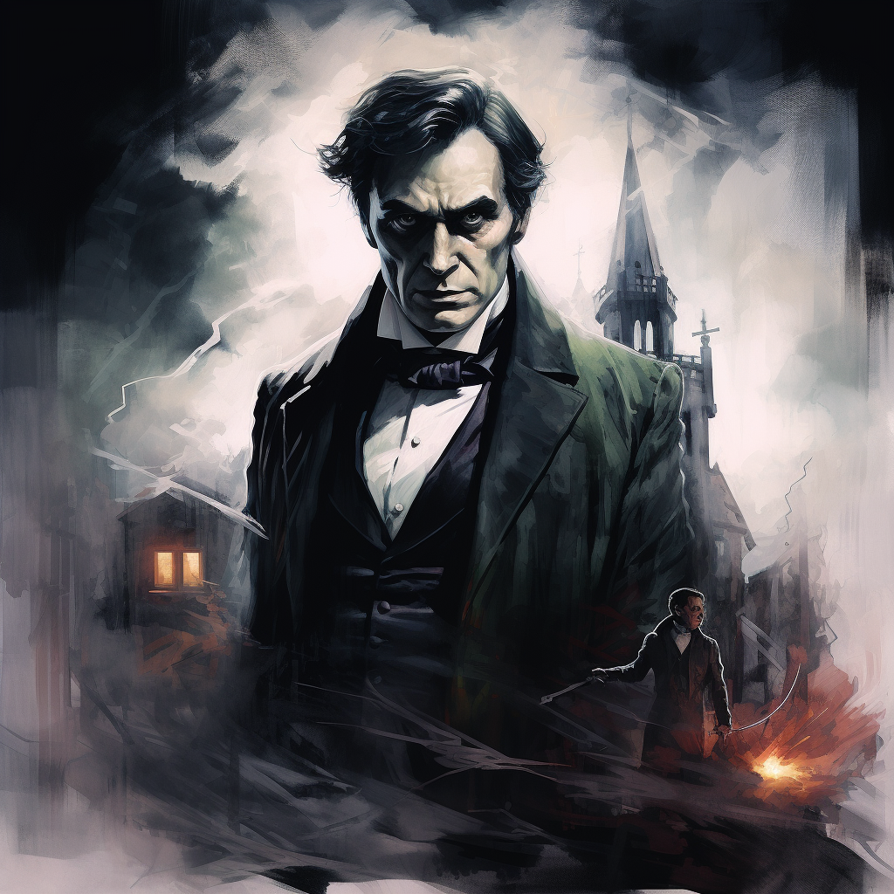

Review: Strange Case of Dr. Jekyll and Mr. Hyde by R.L. Stevenson

Rating: 5/5

Date: 1886

Length: 141

Difficulty: 2/5

Dr. Jekyll and Mr. Hyde is a great book/novella written by Robert Louis Stevenson. It tells the story of Dr. Jekyll/Mr. Hyde from the perspective of Mr. Utterson.

---

Quick summary:

In this book, several events happen including a girl being trampled by Mr. Hyde, Danvers Carew being beaten to death by Mr. Hyde, and the death of Dr. Lanyon (a mutual friend of Jekyll and Utterson). Although Dr. Jekyll attempts to return to his sociable self for 2 months, he eventually relapses.

Utterson and Poole (Jekyll's butler) eventually break into his laboratory where they find Mr. Hyde dead on the floor. Then, Utterson goes home to read 2 letters: the first is from Lanyon telling how he (Lanyon) saw Hyde drink a serum that turned him into Jekyll.

The second letter is written by Jekyll, detailing how he somewhat enjoyed turning into the smaller, more flexible Mr. Hyde; however, Jekyll was running out of an impure salt which would mean that he would be Mr. Hyde forever, and thus he decided to kill himself.

---

Overall, I really enjoyed this book as it explores themes like the duality of man - one side is more animalistic or evil, and the other side is more conformant and polite to society.

Although Jekyll appears to be an upstanding person of society, he secretly enjoys the contrast of being Mr. Hyde.

The novel is also written descriptively and paints a great picture of Victorian/Gothic London. Although it was written in 1886, I found it easy to follow.

---

interesting words:

- troglodytic
- insensate
- sedulously: in a way that shows great care and effort in your work
- diaphanous: light, delicate
- avidity: extreme eagerness or enthusiasm
- mirth: amusement
- ebullition: the act of bubbling
